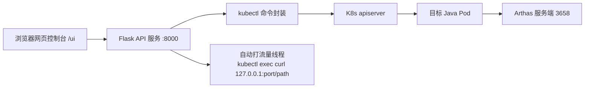

# 🛠️ Arthas 注入 + 诊断命令 API 服务（K8s）

> 对 Kubernetes 集群中运行的 **Java 应用 Pod 自动注入 Arthas**，并提供一个 **Flask 网页控制台 + REST API**，
> 让你**不用进容器敲命令**，点点按钮就能排查"哪个接口慢、慢在哪、对应哪个业务方法"。

[](https://github.com/huajiyibu/arthas_k8s/actions/workflows/ci.yml)

对应需求文档：[`Pod注入Arthas工具及诊断命令API服务需求文档.md`](./Pod注入Arthas工具及诊断命令API服务需求文档.md)

---

## ✨ 它能干什么

一条 API 完成整套 Java 性能诊断：

| 步骤 | 能力 | 说明 |
|------|------|------|
| ① 注入 | 自动把 Arthas 拷进 Pod 并 attach | 支持批量、自定义路径、单批上限 50 Pod |
| ② 慢接口 | 找出耗时超阈值的请求路径 | watch `ApplicationFilterChain` |
| ③ 绑方法 | 按请求路径匹配业务类与方法 | watch `DispatcherServlet` → `类名#方法名` |
| ④ 追踪 | 方法内部调用栈耗时分布 | `trace`，定位到 `Thread.sleep()` 这类元凶 |
| ⑤ 统计 | 方法调用次数 / 平均耗时 / 失败率 | `monitor` |
| ⑥ 链路 | 一键：慢接口 → 绑方法 | 完整排查链路 |

**统一返回格式**：`{code, msg, data}`，`code=200` 成功 / `500` 失败。所有接口支持**批量**（pod 留空 = 命名空间下全部）。

---

## 🏗️ 架构



- **注入原理**：`kubectl cp` 拷贝 Arthas → `arthas-boot.jar` 选目标 JVM attach → 服务端监听 Pod 内 `3658`
- **诊断原理**：`kubectl exec` 进 Pod 用 `arthas-client.jar -c "watch/trace/monitor ..."` 非交互拿结果
- **自动打流量**：监控型接口可自动 `kubectl exec` 进 Pod `curl 127.0.0.1:port/path` 造流量，点一下就能抓到数据

---

## 📁 目录结构

```
arthas/
├── arthas-api/                  # 核心服务（Flask）
│   ├── app.py                   # Flask 入口：注入 + 5 个诊断接口 + 网页控制台
│   ├── diagnose.py              # Arthas 诊断命令封装 + 结果解析 + 自动流量
│   ├── injector.py              # 注入三步：拷文件 + attach
│   ├── kubectl_utils.py         # kubectl 命令封装（带重试）
│   ├── templates/ui.html        # 网页控制台（填参数点按钮）
│   ├── app_fastapi_backup.py    # （备份）早期 FastAPI 版入口，供对照
│   └── README.md                # 服务级说明
├── web-app/                     # 演示用 Spring Boot 应用（含 /fast /slow）
│   ├── src/main/java/com/example/demo/   # DemoApplication + DemoController
│   ├── pom.xml / Dockerfile / deployment.yaml / service.yaml
├── arthas/                      # 内置 Arthas 工具（用于注入，含 arthas-boot.jar 等）
├── math-game-deploy/            # 学习期用 MathGame 示例的部署文件
├── 需求文档.md / 学习日志.md / 从零复现全流程教程.md
├── 实现与需求差异记录.md / 验证状态记录.md
└── README.md
```

---

## 🚀 快速开始

### 环境依赖
- Python 3.10+（本地）、`flask`（pip 安装）
- `kubectl` 能访问目标集群；目标 Pod 为 **JDK 版** Java 应用（JRE 无法 attach）

### 配置（机器相关项，默认即可用）
- **Arthas 工具位置**：默认取 `<项目根>/arthas/arthas`。
  仓库**不内置 Arthas 二进制**（体积大），首次使用先运行下载脚本：
  ```powershell
  powershell -ExecutionPolicy Bypass -File scripts\download_arthas.ps1   # Windows
  bash scripts/download_arthas.sh                                        # Linux/macOS
  ```
  若装在别处，用环境变量覆盖：`set ARTHAS_PARENT_DIR=D:/tools/arthas`
- 集中管理在 [`arthas-api/config.py`](./arthas-api/config.py)，所有配置**环境变量优先**。

### 启动服务

```powershell
cd arthas-api
pip install flask
python app.py          # 服务起在 http://127.0.0.1:8000
```

浏览器打开 **http://127.0.0.1:8000/ui**（网页控制台）或 **/docs**（接口说明）。

### 控制台三步走
1. **① 注入 Arthas**：填命名空间 + Pod（留空=全部）→ 点"执行注入"
2. 把 **Pod** 填成你要诊断的应用（Web 应用），保持"自动打流量"勾选
3. 点 **② 慢接口 / ③ 匹配方法 / ⑥ 链路** → 自动打流量并返回结果

### 运行单元测试

解析逻辑（`has_match` / `extract_uris` / `filter_match_method`）有 pytest 用例：

```powershell
cd arthas-api
..\.venv\Scripts\python.exe -m pytest test_diagnose.py -v
```

### 直接调 API（示例）

```bash
# 注入
curl -X POST http://127.0.0.1:8000/inject -H "Content-Type: application/json" \
  -d '{"namespace":"default","pod":["demo-web-xxx"]}'

# 慢接口查询（自动打流量）
curl -X POST http://127.0.0.1:8000/diagnose/slow-requests -H "Content-Type: application/json" \
  -d '{"namespace":"default","pod":"demo-web-xxx","cost_time":1000,"auto_traffic":true,"traffic_path":"/slow"}'

# 完整链路
curl -X POST http://127.0.0.1:8000/diagnose/chain -H "Content-Type: application/json" \
  -d '{"namespace":"default","pod":"demo-web-xxx","cost_time":1000,"auto_traffic":true}'
```

---

## 📡 API 一览

| 接口 | 方法 | 说明 | 关键入参 |
|---|---|---|---|
| `/` | GET | 服务说明 | - |
| `/ui` | GET | 网页控制台 | - |
| `/docs` | GET | 简易接口文档 | - |
| `/inject` | POST | 批量注入 Arthas | namespace, pod[], copy_path |
| `/diagnose/slow-requests` | POST | 慢接口查询 | cost_time |
| `/diagnose/match-method` | POST | 按 URI 匹配业务方法 | request_uri |
| `/diagnose/trace` | POST | 方法耗时栈追踪 | class_name, method_name, cost_time |
| `/diagnose/monitor` | POST | 方法性能统计 | class_name, cycle |
| `/diagnose/chain` | POST | 完整链路 | cost_time |

> 所有诊断接口可选参数：`auto_traffic`(bool)、`traffic_path`(默认 /slow)、`traffic_port`(默认 8080)。

---

## ✅ 验证结果（真实环境）

在真实 K8s 集群（kubeadm 1.28，2 节点）+ 真实 Spring Boot 应用上，**5 个诊断接口全部验证通过**：
- 慢接口查询：抓到 `/slow` cost≈2000ms（>1000ms 阈值）
- 匹配方法：`/slow → com.example.demo.DemoController#slow`
- trace：定位到 `Thread.sleep()` 2000ms
- monitor：slow 2 次调用，avg-rt 2005ms，成功率 100%
- chain：返回 `uris:["/slow"]` → `match: DemoController.slow`

详细过程见 [`验证状态记录.md`](./验证状态记录.md)。

---

## ⚠️ 已知问题 / 注意事项

- **监控型接口需要流量**：慢接口/匹配方法/链路本质是"监听 30 秒"，期间必须有请求发生（已内置"自动打流量"缓解）
- **只对 Web 应用有效**：慢接口/匹配方法/链路 watch 的是 Spring `DispatcherServlet`，对非 Web 应用（如控制台程序）请用 trace/monitor
- **宿主机↔VM 网络抖动**（VirtualBox + Hyper-V 环境，e1000 模拟网卡偶发卡顿会导致 kubectl TLS 超时）：失败重试即可；彻底解决建议把 VM 网卡换 virtio 或关闭 Hyper-V
- **同一 Pod 反复注入可能卡死 JVM**：一个 Pod 做一轮验证即可；卡死直接删 Pod 重建

---

## 📚 配套文档

- [`从零复现全流程教程.md`](./从零复现全流程教程.md) —— 保姆级复现教程（含 12 个坑索引）
- [`学习日志.md`](./学习日志.md) —— 开发过程学习记录
- [`实现与需求差异记录.md`](./实现与需求差异记录.md) —— 需求 vs 实现差异对照
- [`验证状态记录.md`](./验证状态记录.md) —— 验证进度与踩坑记录

## 📄 License

[MIT](./LICENSE) © 2026 huajiyibu
