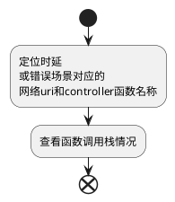

## 5. Arthas（阿尔萨斯）

### 5.1 注入

http://gitlab.tianti.tg.unicom.local/inner_source/cucloud/paas-sop-tool/-/tree/master/arthas_java/arthas_inject_deployment

### 5.2 使用

#### 方法论

简单定位

使用脚本快速加载arthas的jar，并进入java进程，参考注入5.1

##### 时延

```bash
# 查看大于1秒的请求路径
watch org.apache.catalina.core.ApplicationFilterChain doFilter \
'{params[0].getRequestURI(), params[1].getStatus()}' -x 2 '#cost>1000'

####显示如下
#method=org.apache.catalina.core.ApplicationFilterChain.doFilter location=AtExit
#ts=2025-08-12 23:46:33.800; [cost=2021.777748ms] result=@ArrayList[
#    @String[/api/loop],
#    @Integer[200],
#]

# 查看大于1秒的该请求路径对应的类方法
watch org.springframework.web.servlet.DispatcherServlet doDispatch '{
  #uri = params[0].getRequestURI(),
  #chain = target.getHandler(params[0]),
  #handler = #chain != null ? #chain.getHandler() : null,
  #handlerClass = #handler != null ? #handler.getClass().getName() : "null",
  #methodName = (#handler instanceof org.springframework.web.method.HandlerMethod) ? #handler.getMethod().getName() : "N/A",
  new String[]{#uri, #handlerClass, #methodName}
}'  'params[0].getRequestURI().equals("/api/loop")'  -n 5 --skipJDKMethod false

####显示如下
# Affect(class count: 1 , method count: 1) cost in 35 ms, listenerId: 55
# method=org.springframework.web.servlet.DispatcherServlet.doDispatch location=AtExit
# ts=2025-08-12 23:57:02.759; [cost=2016.147304ms] result=@ArrayList[
#     @String[/api/loop],
#     @HandlerExecutionChain[HandlerExecutionChain with [rest.example.rest.controller.UserController#loop(int, int)] and 2 interceptors],
#     @HandlerMethod[rest.example.rest.controller.UserController#loop(int, int)],
#     @String[org.springframework.web.method.HandlerMethod],
#     @String[loop],
#     @String[][isEmpty=false;size=3],
# ]


# 查询时延方法查看调用栈，函数内部各函数花费时间
trace rest.example.rest.controller.UserController loop -n 5 '#cost>1000' --skipJDKMethod false

# 查询调用调用次数时延方法

# 非排序
monitor -c 5 rest.example.rest.controller.UserController *

# ####显示如下
#timestamp                  class                                         method          total（总调用次数）  success         fail    avg-rt(ms)    fail-rate
# ---------------------------------------------------------------------------------------------------------------------------------------------------
#  2025-08-22 14:36:13.920  rest.example.rest.controller.UserController   fibonacci       18755209            18755209        0       0.01          0.00%
# avg-rt(ms)  (平均响应时间 Response Time)
# 平均耗时（平均响应时间）。
# fail-rate  
# 失败率 = fail / total * 100%。
# find 失败率 0.00%。


##按照排序输出
monitor -c 10 rest.example.rest.controller.UserController * | grep -v timestamp | sort -k3 -nr | head -n 5
# ####显示如下---------------------------------------------------------------------------------------------------------------------------------------------------------------------------------------------------------
#  2025-08-22 14:34:23.978        rest.example.rest.controller.UserController   fibonacci                                      31396055       31396055        0              0.01            0.00%

####如果想看数据库语句
watch java.sql.PreparedStatement execute "{params, returnObj}" -x 2


```

##### 错误

一般5xx都伴随业务输出exception错误

```bash
##### 捕获输出exception的url路径
watch org.apache.catalina.core.ApplicationFilterChain doFilter \
'{params[0].getRequestURI(), params[1].getStatus()}' \
-x 2 -n 10 -e


####输出如下
# method=org.apache.catalina.core.ApplicationFilterChain.doFilter location=AtExceptionExit
# ts=2025-08-22 14:16:35.154; [cost=12227.087039ms] result=@ArrayList[
#     @String[/simulateIO],
#     @Integer[200],
# ]

# 查看输出exception该请求路径对应的类方法
watch org.springframework.web.servlet.DispatcherServlet doDispatch '{
  #uri = params[0].getRequestURI(),
  #chain = target.getHandler(params[0]),
  #handler = #chain != null ? #chain.getHandler() : null,
  #handlerClass = #handler != null ? #handler.getClass().getName() : "null",
  #methodName = (#handler instanceof org.springframework.web.method.HandlerMethod) ? #handler.getMethod().getName() : "N/A",
  new String[]{#uri, #handlerClass, #methodName}
}'  'params[0].getRequestURI().equals("/simulateIO")'  -n 5 --skipJDKMethod false

####输出如下
# ts=2025-08-22 14:18:54.273; [cost=22508.318539ms] result=@ArrayList[
#     @String[/simulateIO],
#     @HandlerExecutionChain[HandlerExecutionChain with [rest.example.rest.controller.IOSimulatorController#simulateIO(int, int)] and 2 interceptors],
#     @HandlerMethod[rest.example.rest.controller.IOSimulatorController#simulateIO(int, int)],
#     @String[org.springframework.web.method.HandlerMethod],
#     @String[simulateIO],
#     @String[][isEmpty=false;size=3],
# ]


# 查看调用栈，函数内部各函数花费时间
trace rest.example.rest.controller.IOSimulatorController simulateIO -n 5 --skipJDKMethod false

####输出如下
# Affect(class count: 1 , method count: 1) cost in 588 ms, listenerId: 4
# `---ts=2025-08-22 14:20:20.098;thread_name=http-nio-8080-exec-1;id=29;is_daemon=true;priority=5;TCCL=org.springframework.boot.web.embedded.tomcat.TomcatEmbeddedWebappClassLoader@2f67b837
#     `---[20900.363293ms] rest.example.rest.controller.IOSimulatorController:simulateIO()
#         +---[0.00% 0.003742ms ] java.lang.System:currentTimeMillis() #17
#         +---[100.00% 20899.985108ms ] rest.example.rest.controller.IOSimulatorController:simulateIOFile() #19
#         `---[0.00% 0.003596ms ] java.lang.System:currentTimeMillis() #27


```

##### 全面监控思路

入口方法打点（UserService, OrderService 等业务类） → 用 trace 看调用链。

中间件类打点（JDBC、MyBatis、RedisTemplate） → 用 monitor 看次数、失败率。

watch 在需要时捕获 参数/返回值。


###### 统计脚本
在 Arthas console 中执行：

@middleware_trace.arthas

```
`---ts=2025-08-21 20:30;thread_name=http-nio-8080-exec-5;id=12;is_daemon=false;priority=5;TCCL=org.springframework.boot.devtools.restart.classloader.RestartClassLoader
    `---[0.28ms] com.example.service.UserService:find()
        `---[0.21ms] org.mybatis.spring.SqlSessionTemplate:selectOne()
            `---[0.20ms] java.sql.PreparedStatement:executeQuery()
        `---[0.05ms] org.springframework.data.redis.core.RedisTemplate:opsForValue.get()
        `---[0.02ms] com.mongodb.client.MongoCollection:find() 
```

@middleware_monitor.arthas

```
timestamp         class-method                                      total  success  fail  rt   fail-rate
2025-08-21 20:00  java.sql.PreparedStatement.executeQuery           520    520      0     3ms  0.00%
2025-08-21 20:00  RedisTemplate.opsForValue.get                     300    298      2     1ms  0.66%
2025-08-21 20:00  KafkaProducer.send                                120    120      0     2ms  0.00%
2025-08-21 20:00  MongoCollection.find                              80     80       0     5ms  0.00% 
```