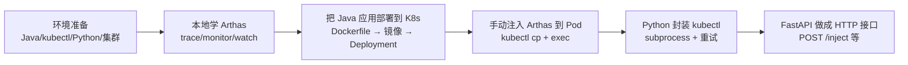
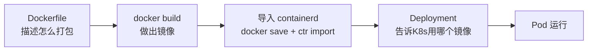

# 🎓 从零复现：Arthas 注入 + 诊断 API 服务 —— 完整小白教程

> **这份教程写给谁**：完全不懂 Java、只懂一点 Python 和命令行的你。
> **学完你能做到**：亲手复现今天 AI 带你做的所有事——从环境准备，到把一个 Java 应用部署进 K8s，到用 Arthas 诊断它，再到用 Python + FastAPI 把这套流程变成 HTTP 接口服务。

---

# 第 0 章：先搞懂这个项目到底在干嘛

## 0.1 一句话版本

**做一个服务，能自动往 K8s 集群里运行 Java 应用的 Pod "打针"（注入 Arthas 诊断工具），并提供 HTTP 接口让人随时查询这个应用的性能问题（哪个接口慢、慢在哪个方法、方法内部哪一步最耗时）。**

## 0.2 完整流程图



## 0.3 必须认识的技术名词（超通俗版）

| 名词 | 通俗解释 | 类比 |
|---|---|---|
| **Java 程序** | 用 Java 写的应用，运行在 JVM 里 | 一台"机器" |
| **JVM** | 运行 Java 程序的"虚拟机" | 机器的"发动机" |
| **JRE** | Java 运行时环境，能**运行** Java 程序 | 只有"播放器" |
| **JDK** | Java 开发工具包，能运行 + **诊断/管理** | "播放器 + 工具箱" |
| **Arthas** | 阿里巴巴的 Java 在线诊断工具 | 给运行中的程序做"X光/手术" |
| **K8s (Kubernetes)** | 容器编排平台，管理大量容器 | 容器"调度中心" |
| **Pod** | K8s 里最小的运行单元，程序住在里面 | 一个"宿舍" |
| **Deployment** | 描述"我要几个 Pod"的声明 | 一张"排班表" |
| **镜像 (Image)** | 打包好的运行环境（含程序+依赖） | 一个"出厂盒子" |
| **containerd** | K8s 实际用的容器运行时 | 开箱子的"工人" |
| **Docker** | 另一套构建/运行容器的工具 | 另一批"工人" |
| **API** | 别人能通过 HTTP 调用的接口 | 餐馆的"点菜单" |
| **FastAPI** | Python 的 Web 框架，快速做接口 | 快速摆摊的"摊位架" |
| **subprocess** | Python 里执行外部命令的模块 | Python 里的"传声筒" |

---

# 第 1 章：环境准备（摸底）

## 1.1 你需要什么

| 东西 | 用途 | 怎么检查 |
|---|---|---|
| Java (建议 JDK 8+) | 跑 Java 程序 + 运行 Arthas | `java -version` |
| kubectl | 操作 K8s 集群 | `kubectl version --client` |
| Python 3 | 写 API 服务 | `python --version` |
| 一个 K8s 集群 | 部署应用 | `kubectl get nodes` |

## 1.2 检查本机环境

打开 PowerShell，依次敲（可以一条命令里用 `;` 连接）：

```powershell
java -version 2>&1
kubectl version --client 2>&1 | Select-Object -First 2
python --version 2>&1
```

**预期**：能看到 Java 版本号、kubectl 版本号、Python 版本号。

## 1.3 ⚠️ 坑①：JRE vs JDK（Arthas 找不到进程）

**症状**：运行 `java -jar arthas-boot.jar` 时报：
```
[INFO] Can not find java process. Try to run `jps` command ...
```

**为什么**：Arthas 要"挂载"到 Java 进程上，靠的是 JDK 自带的 `jps`（列进程）和 attach（挂载）机制。如果系统 `java` 用的是 **JRE**（只有运行能力，没有这些工具），就找不到进程。

**排查方法**：
```powershell
# 1. 看用的是 JRE 还是 JDK（出现 "Runtime Environment" 就是 JRE）
java -version
# 2. 试 jps 命令（找不到就说明是 JRE）
jps -l
# 3. 看机器上装了哪些 Java
Get-ChildItem "C:\Program Files\Java"
```

**解决**：让 `java` 指向 JDK（不是 JRE）。
```powershell
# 设置用户级环境变量：JAVA_HOME 指向 JDK 目录
[Environment]::SetEnvironmentVariable('JAVA_HOME', 'C:\Program Files\Java\jdk1.8.0_341', 'User')
# 把 JDK 的 bin 加到 PATH 最前面
$p = [Environment]::GetEnvironmentVariable('Path','User')
[Environment]::SetEnvironmentVariable('Path', "C:\Program Files\Java\jdk1.8.0_341\bin;$p", 'User')
```

## 1.4 ⚠️ 坑②：VS Code 环境变量缓存（改了不生效）

**症状**：配置完环境变量后，**新开的终端** `jps` 还是找不到。

**为什么**：VS Code 在**启动那一刻**读取环境变量，之后新开的终端标签页都**继承旧环境**，不会重新读注册表。

**解决**：
- **临时生效**（当前终端）：`$env:Path = "C:\Program Files\Java\jdk1.8.0_341\bin;" + $env:Path`
- **永久生效**：重启 VS Code（配置已经写进注册表了，重启后新终端自动用 JDK）

> 这是 Windows 开发超常见坑，记住"VS Code 缓存旧环境"这个规律。

## 1.5 本地 kubectl 连集群（拿到 kubeconfig）

本地要能操作集群，需要 **kubeconfig**（集群连接凭证）放到 `C:\Users\huaji\.kube\config`。

**如果你有一台能连集群的虚机/服务器**，在它上面执行：
```bash
cat ~/.kube/config
```
把完整内容复制出来，在本地创建 `C:\Users\huaji\.kube\config` 粘贴进去。

> ⚠️ kubeconfig 含证书和密钥，**妥善保管，别外传**。

**验证**：
```powershell
kubectl get nodes
```
能看到集群节点（`Ready` 状态）就说明连上了。

---

# 第 2 章：本地玩转 Arthas（打基础）

## 2.1 认识"病人"程序 math-game

`math-game.jar` 是 Arthas 官方自带的演示程序：它会不停做**质因数分解**（把 156248 拆成 2*2*2*19531），还故意时不时抛异常（传负数）。就像一台"一直干活、偶尔坏"的机器。

**它在哪里**：项目里的 `arthas/arthas/arthas/arthas/math-game.jar`（路径可能因目录结构不同）。

## 2.2 启动"病人"

新开一个终端，进入 jar 所在目录，运行：
```powershell
java -jar math-game.jar
```
**预期**：屏幕不停打印质因数分解结果和 `illegalArgumentCount` 错误。**这个终端别关**（程序要一直跑着）。

## 2.3 启动 Arthas 并 attach（挂载）

**再新开一个终端**，进入 arthas 工具目录（含 arthas-boot.jar），运行：
```powershell
java -jar arthas-boot.jar
```
**预期**：
1. 列出本机所有 Java 进程（能看到 math-game）
2. 提示你输入序号 → 输入 `1` 回车
3. 看到 Arthas 图标和 `[arthas@PID]$` 提示符 —— **成功"钻进"了程序内部**

> 这一步就是需求文档里说的"模拟输入序号 1 完成进程绑定"。

## 2.4 三大核心命令

### ① trace：方法耗时调用栈（"慢在哪一步"）

```bash
trace demo.MathGame primeFactors
```
**输出长这样**：
```
`---[2.05ms] demo.MathGame:primeFactors() [throws Exception]
    +---[2.40% 0.04915ms ] java.lang.StringBuilder:<init>() #46
    +---[3.41% ...] java.lang.StringBuilder:append() #46
    `---throw:java.lang.IllegalArgumentException #46 [number is: -184464, need >= 2]
```
**怎么读**：
- `[2.05ms]`：这次调用花了多少毫秒
- `+---` / `` `--- ``：方法内部调用的子方法（缩进表示层级）
- `[百分比 毫秒]`：子方法耗时占总耗时的比例和实际耗时
- `[throws Exception]`：这次调用抛异常了；下面 `throw:` 是异常详情
- `[number is: -184464, need >= 2]`：传了个负数，程序要求数字 ≥ 2，所以报错

### ② monitor：性能统计（"成绩单"）

```bash
monitor -c 3 demo.MathGame primeFactors
```
**输出长这样**（每 3 秒一张表）：
```
 timestamp            class          method        total  success  fail  avg-rt(ms)  fail-rate
 2026-08-03 10:27:47  demo.MathGame  primeFactors  3      2        1     0.23        33.33%
```
**怎么读**：`total` 调用次数、`success` 成功数、`fail` 失败数、`avg-rt` 平均耗时、`fail-rate` 失败率。失败 = 方法抛异常了。

### ③ watch：捕获参数和返回值（"进出的东西"）

```bash
watch demo.MathGame primeFactors '{params, returnObj}' -x 2 -n 4
```
**输出长这样**：
```
method=demo.MathGame.primeFactors location=AtExceptionExit
result=@ArrayList[ @Object[][ @Integer[-106792] ], null ]
```
**怎么读**：
- `params`：传进来的参数（这里是负数 -106792）
- `returnObj`：返回值（抛异常那次是 `null`）
- `location=AtExit`（正常退出）/ `AtExceptionExit`（异常退出）

## 2.5 关于 3658 端口

Arthas attach 成功后，会在被诊断进程里**常驻一个监听端口 3658**（相当于装了"对讲机"）。进程不重启它就在。所以**重复 attach 时会显示 `skip attach`，直接连**。这也是后续自动化的关键。

---

# 第 3 章：把 Java 应用部署到 K8s

## 3.1 思路：K8s 不直接"收文件"，它运行"镜像"

要往 K8s 放应用，必须做成**镜像**（打包好的运行环境），K8s 用它跑 Pod。



## 3.2 写 Dockerfile（打包"配方"）

在某个目录建 `Dockerfile` 文件：
```dockerfile
# 基于一个带 Java 8 JDK 的基础镜像（注意用 JDK 版，后面注入 Arthas 需要 attach 能力）
FROM eclipse-temurin:8
WORKDIR /app
COPY math-game.jar /app/math-game.jar
CMD ["java", "-jar", "math-game.jar"]
```
每行含义：
- `FROM`：基础镜像（相当于"地基"，这里用带 Java8 的官方镜像）
- `WORKDIR`：进入工作目录
- `COPY`：把本地的 jar 拷进镜像
- `CMD`：容器启动时运行的命令

> ⚠️ **不要用 `openjdk:8`**：Docker Hub 已废弃 openjdk 官方镜像（会报 `not found`），用 `eclipse-temurin`（还在维护）。

## 3.3 ⚠️ 构建镜像的一堆坑

### 坑③：镜像加速器 429
构建时报 `429 Too Many Requests` → 你配置的国内镜像加速源挂了。要么换源，要么直连（需要代理）。

### 坑④：虚机 NAT 不走主机梯子
虚机是 NAT 模式，**默认不走你 Windows 主机的代理**。要配置 Docker 走主机的代理端口：
```bash
# 在虚机上，写 docker 的代理配置（把 192.168.56.1:7897 换成你主机的代理地址:端口）
sudo mkdir -p /etc/systemd/system/docker.service.d
sudo tee /etc/systemd/system/docker.service.d/http-proxy.conf > /dev/null <<'EOF'
[Service]
Environment="HTTP_PROXY=http://192.168.56.1:7897"
Environment="HTTPS_PROXY=http://192.168.56.1:7897"
Environment="NO_PROXY=localhost,127.0.0.1"
EOF
sudo systemctl daemon-reload && sudo systemctl restart docker
```

### 构建命令
```bash
cd <Dockerfile所在目录>
docker build -t math-game:jdk .
```

## 3.4 分发镜像到 kubelet 的 containerd

**关键**：Docker 和 K8s 用的 containerd 是**两套运行时**，Docker 构建的镜像要"搬"过去：
```bash
docker save math-game:jdk -o /tmp/math-game-jdk.tar
sudo ctr -n k8s.io images import /tmp/math-game-jdk.tar
```
验证：`sudo ctr -n k8s.io images list | grep math-game`，能看到 `io.cri-containerd.image=managed` 就对了（kubelet 能识别）。

## 3.5 写 Deployment 并部署

建 `deployment.yaml`：
```yaml
apiVersion: apps/v1
kind: Deployment
metadata:
  name: math-game
  namespace: default
spec:
  replicas: 1
  selector:
    matchLabels:
      app: math-game
  template:
    metadata:
      labels:
        app: math-game
    spec:
      containers:
      - name: math-game
        image: math-game:jdk
        imagePullPolicy: IfNotPresent   # 不从远程拉，用 containerd 里已有的
```
部署：
```powershell
kubectl apply -f deployment.yaml
kubectl get pods -l app=math-game
```

## 3.6 ⚠️ 坑⑤：Pod 一直 Pending（污点 taint）

**症状**：Pod 状态 `Pending`，`kubectl describe pod <name>` 的 Events 显示：
```
0/2 nodes are available: 1 node(s) had untolerated taint {node-role.kubernetes.io/control-plane}
```

**为什么**：master 是控制面节点，自带一个"闲人免进"污点（taint），普通业务 Pod 默认不调度上去。

**解决**：去掉污点
```powershell
kubectl taint nodes master node-role.kubernetes.io/control-plane-
```
去掉后 Pod 就能调度到 master 上运行了。

---

# 第 4 章：手动注入 Arthas 到 Pod

**核心认知：注入 = 拷文件 → 启动 → 选进程**，和本地玩 Arthas 一样，只是把"本地终端"换成了"Pod 里的终端"。

## 4.1 第一步：拷文件（kubectl cp）

```powershell
# 先 cd 到 arthas 的父目录（用相对路径，避开 Windows 盘符坑）
cd "c:\...\arthas"
kubectl cp arthas default/<pod名>:/tmp/
```
验证：`kubectl exec <pod名> -- ls /tmp/arthas` 能看到 arthas-boot.jar 等文件。

> ⚠️ **坑⑥：Windows 盘符冒号**。`kubectl cp` 判断"本地 vs Pod 路径"靠冒号 `:`，而本地路径 `C:\...` 的盘符冒号会被误判。**用相对路径（先 cd 再 cp）解决**。

## 4.2 第二步：启动并 attach（kubectl exec）

```powershell
kubectl exec -it <pod名> -- java -jar /tmp/arthas/arthas-boot.jar
```
输入 `1` 选择进程 → 进入 `[arthas@1]$`。

> ⚠️ **坑⑦**：`kubectl exec` 要用 `-n 命名空间` + `pod名` 的写法，**不支持 `ns/pod` 斜杠**（斜杠会被当成"资源类型"）。而 `kubectl cp` 支持 `ns/pod:路径`。**两个命令语法不一样**，注意区分。

## 4.3 第三步：在 Pod 里诊断

在 `[arthas@1]$` 里敲 trace/monitor/watch，和本地一模一样，只是"病人"在集群里。

---

# 第 5 章：用 Python 封装（自动化）

## 5.1 subprocess：Python 里执行外部命令

`subprocess` 是 Python 标准库，让 Python 执行外部命令并拿结果。

```python
import subprocess

result = subprocess.run(
    ["kubectl", "get", "pods", "-o", "wide"],  # 命令和参数拆开写成列表
    capture_output=True,   # 捕获输出，不刷屏
    text=True              # 输出转成文本
)
print(result.stdout)       # 正常输出
print(result.stderr)       # 错误输出
print(result.returncode)   # 退出码（0=成功）
```

**核心认知**：命令输出分两个通道——
- **stdout**：正常输出
- **stderr**：错误/诊断输出
- **returncode**：退出码（0 成功，非 0 失败）

> ⚠️ **坑⑧**：程序"没输出"往往不是没执行，而是**错误在 stderr 里、stdout 是空的**。排障一定要三个都看。

## 5.2 封装带重试的 run_kubectl

集群偶发连接抖动（TLS 超时），所以要加重试。完整代码：

```python
import subprocess
import time

def run_kubectl(args, retries=3):
    """执行 kubectl 命令，失败自动重试。"""
    for attempt in range(retries):
        result = subprocess.run(
            ["kubectl"] + args,
            capture_output=True,
            text=True
        )
        if result.returncode == 0:      # 成功
            return result.stdout
        print(f"第{attempt+1}次失败: {result.stderr.strip()}, 重试...")
        time.sleep(1)                   # 等 1 秒再试
    raise RuntimeError(f"kubectl 执行失败: {result.stderr}")
```

## 5.3 封装注入三步（copy + attach）

```python
def copy_arthas_to_pod(pod, namespace="default", copy_path="/tmp/arthas"):
    """把本地 arthas 拷进 Pod（注入第1步）"""
    parent_dir = copy_path.rsplit("/", 1)[0] or "/"
    subprocess.run(["kubectl", "exec", "-n", namespace, pod, "--", "sh", "-c",
                    f"mkdir -p {parent_dir}"], capture_output=True, text=True)
    result = subprocess.run(
        ["kubectl", "cp", "arthas", f"{namespace}/{pod}:{parent_dir}/"],
        cwd=ARTHAS_PARENT_DIR,          # 用相对路径避开盘符坑
        capture_output=True, text=True,
    )
    if result.returncode != 0:
        raise RuntimeError(f"拷贝失败: {result.stderr}")
    return f"已拷贝到 {namespace}/{pod}:{copy_path}"
```

attach 的自动化（关键难点）：
```python
import subprocess

def start_arthas(pod, namespace="default", copy_path="/tmp/arthas", timeout=25, retries=2):
    """在 Pod 里启动 arthas 并自动 attach（注入第2步）"""
    boot_jar = f"{copy_path}/arthas-boot.jar"
    for attempt in range(retries):
        p = subprocess.Popen(
            ["kubectl", "exec", "-i", "-n", namespace, pod, "--", "sh", "-c",
             f'printf "1\\n" | java -jar {boot_jar}'],
            stdout=subprocess.PIPE, stderr=subprocess.PIPE, text=True,
        )
        try:
            out, err = p.communicate(timeout=timeout)
        except subprocess.TimeoutExpired:
            p.kill()                      # attach 已完成，杀掉即可
            out, err = p.communicate()
        output = out + err
        # attach 成功：新 attach 或之前已注入（skip attach）
        if ("Attach process" in output and "success" in output) or ("skip attach" in output):
            return output
    raise RuntimeError(f"attach 失败: {output}")
```

> ⚠️ **坑⑨：为什么 attach 后界面会"卡住"**——Arthas attach 成功后，交互界面走的是 **telnet(3658 端口)**，**不再读 stdin**。所以用管道喂 `quit` 无效。**策略**：只喂 `1` 完成 attach，然后让命令超时被 kill 就行——**attach 的成果（3658 服务端）已经留在进程里了**。

## 5.4 封装诊断命令（用 arthas-client 非交互执行）

attach 后服务端在 `127.0.0.1:3658`，用 `arthas-client.jar` 非交互执行命令：
```python
def run_arthas_command(pod, command, namespace="default", copy_path="/tmp/arthas", timeout=30):
    """在 Pod 里非交互执行一条 Arthas 命令"""
    client_jar = f"{copy_path}/arthas-client.jar"
    result = subprocess.run(
        ["kubectl", "exec", "-n", namespace, pod, "--",
         "java", "-jar", client_jar, "-c", command],
        capture_output=True, text=True, timeout=timeout,
    )
    return result.stdout + result.stderr
```

---

# 第 6 章：做成 FastAPI 服务

## 6.1 FastAPI 是什么

Python Web 框架，用 `@app.post("/路径")` 装饰器把函数变成 HTTP 接口。别人用浏览器/curl 就能调用你的 Python 函数。

## 6.2 代码结构（4 个文件）

```
arthas-api/
├── kubectl_utils.py   # 带重试的 kubectl 执行
├── injector.py        # 注入三步（拷文件 + attach）
├── diagnose.py        # 诊断命令执行（4 个诊断函数）
└── app.py             # FastAPI 服务入口
```

## 6.3 app.py 的核心写法

```python
from fastapi import FastAPI
from pydantic import BaseModel

app = FastAPI(title="Arthas 注入 + 诊断 API 服务")

# 定义接口要收什么参数（Pydantic 模型）
class InjectRequest(BaseModel):
    namespace: str
    pod: list[str]

# 统一返回格式
def ok(data=None, msg="成功"):
    return {"code": 200, "msg": msg, "data": data}

# 接口：用 @app.post 装饰器
@app.post("/inject")
def inject(req: InjectRequest):
    try:
        for pod_name in req.pod:
            copy_arthas_to_pod(pod_name, req.namespace)
            start_arthas(pod_name, req.namespace)
        return ok(msg="注入成功")
    except Exception as e:
        return {"code": 500, "msg": f"注入失败: {e}", "data": None}
```

## 6.4 启动服务

```powershell
& .venv\Scripts\python.exe -m uvicorn app:app --app-dir arthas-api --host 127.0.0.1 --port 8000
```

> ⚠️ **坑⑩**：uvicorn 默认在当前目录找 `app` 模块，如果不在 arthas-api 目录，要用 `--app-dir` 指定。

## 6.5 测试接口

- **接口文档（最爽的）**：浏览器打开 `http://127.0.0.1:8000/docs`，可以**在线点按钮调用**接口
- **命令行测**：PowerShell 里用 `Invoke-RestMethod`（curl 是别名，会踩坑）：
```powershell
$body = '{"namespace":"default","pod":["math-game-xxx"]}'
$r = Invoke-RestMethod -Uri http://127.0.0.1:8000/inject -Method Post -ContentType "application/json" -Body $body
$r | ConvertTo-Json -Depth 5
```

---

# 第 7 章：踩坑大全（按现象索引）

| # | 现象 | 原因 | 解决 |
|---|---|---|---|
| ① | Arthas 找不到进程 | 用了 JRE 没有 jps/attach | JAVA_HOME 指向 JDK |
| ② | 环境变量改了不生效 | VS Code 缓存旧环境 | 重启 VS Code 或临时改 $env:Path |
| ③ | docker pull 429 | 镜像加速源挂了 | 换源或直连（配代理） |
| ④ | 虚机拉不到镜像 | NAT 不走主机梯子 | 给 docker 配主机代理 |
| ⑤ | Pod 一直 Pending | master 有 control-plane 污点 | `kubectl taint nodes master ...-` |
| ⑥ | kubectl cp 报"must be local" | 盘符 `C:` 被当 Pod 路径 | 用相对路径 + cwd |
| ⑦ | kubectl exec 报"resource type" | 用了 `ns/pod` 斜杠 | 用 `-n ns pod` |
| ⑧ | 脚本"没输出" | 错误在 stderr | 打印 stdout+stderr+returncode |
| ⑨ | attach 后界面卡住/超时 | 界面走 telnet 不读 stdin | 只喂序号，超时 kill |
| ⑩ | uvicorn 找不到 app | 目录不对 | 用 `--app-dir` |
| ⑪ | openjdk 镜像 not found | Docker Hub 废弃了它 | 用 eclipse-temurin |
| ⑫ | 集群刚开机连不上 | apiserver 初始化中 | 等几分钟 + 加重试 |

---

# 附录 A：完整代码

完整 4 个文件的最终代码，见项目里的 `arthas-api/` 目录（`kubectl_utils.py`、`injector.py`、`diagnose.py`、`app.py`），每个文件都带详细中文注释，可以一行行对照本教程阅读。

# 附录 B：常用命令速查

```powershell
# 环境
java -version                     # 看 Java 版本
kubectl get nodes                 # 看集群节点
kubectl get pods -A               # 看所有 Pod

# 本地玩 Arthas
java -jar math-game.jar           # 启动"病人"程序
java -jar arthas-boot.jar         # 启动 Arthas（然后输序号 attach）
trace demo.MathGame primeFactors  # 方法耗时栈（在 arthas 界面里敲）
monitor -c 3 demo.MathGame primeFactors   # 统计
watch demo.MathGame primeFactors '{params, returnObj}' -x 2 -n 4  # 进出参

# K8s 部署
docker build -t math-game:jdk .   # 构建镜像
docker save math-game:jdk -o m.tar # 导出
sudo ctr -n k8s.io images import m.tar   # 导入 containerd
kubectl apply -f deployment.yaml   # 部署

# 注入
kubectl cp arthas <pod>:/tmp/      # 拷文件（先 cd 到 arthas 父目录）
kubectl exec -it <pod> -- java -jar /tmp/arthas/arthas-boot.jar  # 启动attach

# 启动 API 服务
& .venv\Scripts\python.exe -m uvicorn app:app --app-dir arthas-api --host 127.0.0.1 --port 8000
```

---

> **最后的话**：这份教程里所有命令，都是你今天亲自跑过的。看不懂任何一步，把那一章的代码或输出发给 AI，让它陪你逐行拆解。**你的目标不是背下命令，而是理解"每一步在做什么、为什么"**。学完你就能真正独立复现了。加油！💪
